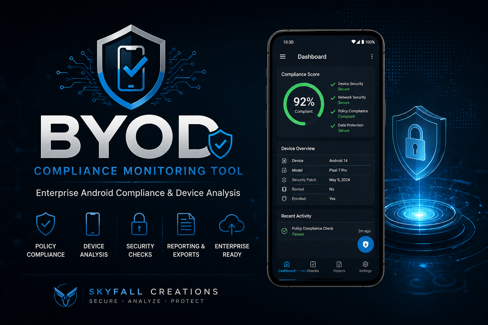

<p align="center">
  
</p>

# BYOD Compliance Monitoring Tool

<p align="center">
A Python framework for authorized Android BYOD compliance auditing, data collection, and reporting.
</p>


---

## Overview

The **BYOD Compliance Monitoring Tool** is a modular Python framework designed to assist administrators and security professionals with authorized Android BYOD compliance auditing and reporting through Android Debug Bridge (ADB).

> **Authorized Use Only**  
> This project is intended only for devices you own or are explicitly authorized to assess.

---

## Features

- Android Debug Bridge (ADB) integration
- Contact extraction
- SMS/MMS analysis
- Call log collection
- Report generation
- Modular architecture
- Cross-platform support (Windows, macOS, Linux)

---

## Quick Start

```bash
git clone https://github.com/YOUR_GITHUB_USERNAME/BYOD-Compliance-Monitoring-Tool.git
cd BYOD-Compliance-Monitoring-Tool
pip install -r requirements.txt
python main.py
```

Replace `YOUR_GITHUB_USERNAME` with your GitHub username.

---

## Requirements

- Python 3.8+
- Android Platform Tools (ADB)
- Android device with USB Debugging enabled

---

## Project Structure

```text
demo.png
README.md
main.py
requirements.txt
install.sh
install.ps1
config/
src/
output/
```

---

## Roadmap

- Additional compliance modules
- Improved reporting
- Dashboard enhancements
- Automated testing
- Expanded documentation

---

## Disclaimer

This software is intended for legitimate administrative, compliance, educational, and authorized security testing purposes only. Users are responsible for complying with all applicable laws and organizational policies.

---

## License

This project is licensed under the **MIT License**.

---

<p align="center">
Built for authorized security, compliance, and enterprise administration.
</p>
